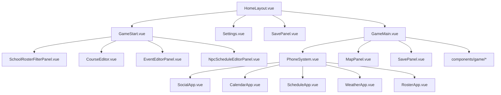

# 组件地图（自动生成）

> 生成日期：2026-03-06  
> 关注范围：`school/src/components` 与 `school/src/composables`。

## 组件层结构

- `HomeLayout.vue` 是页面切换壳层，通过异步组件装配主菜单、开局页、设置页、读档页和主游戏页。
- `GameStart.vue` 是开局配置中心，向下连接名册、课程、事件、日程、数据导入等重型编辑面板。
- `GameMain.vue` 是核心交互页，向下聚合地图、装备、存档、手机系统、调试面板与多个 game 子组件。
- `PhoneSystem.vue` 是游戏内二级容器，承载社交、日程、天气、兼职、名册、校规等 App。
- `SchoolRosterFilterPanel.vue` 是后台运营面板，集中使用多个 composable 和编辑器组件。

## 组件高层图

## 组件出度前十

- `school/src/components/GameMain.vue`：直接依赖 37 个模块。
- `school/src/components/SchoolRosterFilterPanel.vue`：直接依赖 30 个模块。
- `school/src/components/PhoneSystem.vue`：直接依赖 21 个模块。
- `school/src/components/GameStart.vue`：直接依赖 14 个模块。
- `school/src/components/HomeLayout.vue`：直接依赖 13 个模块。
- `school/src/components/AutoSchedulePanel.vue`：直接依赖 9 个模块。
- `school/src/components/DataTransferPanel.vue`：直接依赖 8 个模块。
- `school/src/components/ClassRosterPanel.vue`：直接依赖 7 个模块。
- `school/src/components/ScheduleApp.vue`：直接依赖 7 个模块。
- `school/src/components/RosterApp.vue`：直接依赖 6 个模块。

## Composables 使用图

| 文件 | 出度 | 入度 | 主要使用者 | 函数摘录 |
|---|---|---|---|---|
| `school/src/composables/index.js` | 4 | 0 | — | — |
| `school/src/composables/useAIImport.js` | 5 | 1 | `school/src/components/SchoolRosterFilterPanel.vue` | `useAIImport`、`parseAttributes`、`clampValue`、`buildAIImportPrompt`、`parseAIImportResponse` |
| `school/src/composables/useAutoClubGenerate.js` | 2 | 2 | `school/src/components/AutoSchedulePanel.vue`、`school/src/components/SchoolRosterFilterPanel.vue` | `useAutoClubGenerate`、`buildClubPrompt`、`parseClubResponse`、`splitIntoBatches`、`generateClubs` |
| `school/src/composables/useAutoSchedule.js` | 4 | 1 | `school/src/components/AutoSchedulePanel.vue` | `useAutoSchedule`、`buildClassSummary`、`buildCourseSummary`、`buildSchedulePrompt`、`parseScheduleResponse` |
| `school/src/composables/useBatchComplete.js` | 4 | 1 | `school/src/components/SchoolRosterFilterPanel.vue` | `useBatchComplete`、`parseAttributes`、`clampValue`、`deepClone`、`getBatchCandidates` |
| `school/src/composables/useCharacterPool.js` | 2 | 1 | `school/src/components/SchoolRosterFilterPanel.vue` | `useCharacterPool`、`deepClone`、`loadCharacterPool`、`isDefaultPersonality`、`isDefaultAcademic` |
| `school/src/composables/useDanmaku.js` | 0 | 4 | `school/src/components/GameMain.vue`、`school/src/components/game/DanmakuLayer.vue`、`school/src/composables/index.js`、`school/src/utils/performanceTest.js` | `useDanmaku`、`showDanmaku`、`startCleanupTimer`、`cleanup`、`clearDanmaku` |
| `school/src/composables/useEventCarousel.js` | 1 | 4 | `school/src/components/GameMain.vue`、`school/src/components/game/EventBanner.vue`、`school/src/components/game/EventIndicator.vue`、`school/src/composables/index.js` | `useEventCarousel`、`startCarousel`、`stopCarousel`、`collapseBanner`、`expandBanner` |
| `school/src/composables/useImageCache.js` | 1 | 3 | `school/src/components/GameMain.vue`、`school/src/components/game/ImageInteractionPanel.vue`、`school/src/composables/index.js` | `useImageCache`、`base64ToBlobUrl`、`processImageLoadQueue`、`queueImageLoad`、`loadImagesFromLog` |
| `school/src/composables/useRosterData.js` | 3 | 1 | `school/src/components/SchoolRosterFilterPanel.vue` | `useRosterData`、`getCleanOrigin`、`getStudentClubs`、`loadData` |
| `school/src/composables/useScrollControl.js` | 0 | 2 | `school/src/components/GameMain.vue`、`school/src/composables/index.js` | `useScrollControl`、`easeInOutQuad`、`scrollToBottom`、`animateScroll`、`handleNewContent` |

### 根目录组件

| 文件 | 行数 | 出度 | 入度 | 关键依赖 | 函数摘录 |
|---|---|---|---|---|---|
| `school/src/components/AIImportModal.vue` | 653 | 0 | 1 | — | `addEntry`、`removeEntry`、`handleClose`、`handleSubmit`、`handleConfirm` |
| `school/src/components/ActiveEffectsPanel.vue` | 328 | 1 | 1 | `gameStore.ts` | `getEffectIcon`、`formatValue` |
| `school/src/components/AttributeAllocationPanel.vue` | 498 | 0 | 1 | — | `updateValue`、`setAddedValue`、`getTotal` |
| `school/src/components/AttributeLevelUp.vue` | 288 | 1 | 1 | `gameStore.ts` | `addPoint`、`addPotential`、`addSkill` |
| `school/src/components/AutoSchedulePanel.vue` | 363 | 9 | 1 | `useAutoSchedule.js`、`useAutoClubGenerate.js`、`coursePoolData.js`、`worldbookParser.js` | `buildCoursePool`、`handleStep1Next`、`handleStep2Next`、`handleStep2Back`、`handleStep3Back` |
| `school/src/components/AvatarDisplay.vue` | 89 | 1 | 1 | `gameStore.ts` | `triggerUpload`、`handleFileChange` |
| `school/src/components/BatchCompleteModal.vue` | 382 | 0 | 1 | — | — |
| `school/src/components/CalendarApp.vue` | 823 | 2 | 1 | `gameStore.ts`、`scheduleGenerator.js` | `getEventClass`、`prevMonth`、`nextMonth`、`selectDate`、`addCustomEvent` |
| `school/src/components/CharacterEditModal.vue` | 645 | 1 | 1 | `academicData.js` | `addAssignment`、`removeAssignment`、`togglePending`、`toggleTrait`、`openWorkplaceMapEditor` |
| `school/src/components/CharacterEditor.vue` | 522 | 0 | 1 | — | `getCleanOrigin`、`getClassName`、`getRoleLabel` |
| `school/src/components/CharacterInfo.vue` | 224 | 3 | 1 | `gameStore.ts`、`AttributeLevelUp.vue`、`ActiveEffectsPanel.vue` | `toggleExpand` |
| `school/src/components/ClassComposer.vue` | 898 | 0 | 1 | — | `onResize`、`getCleanOrigin`、`getRoleLabel`、`toggleWorkGroup`、`getWorkAddedCount` |
| `school/src/components/ClassRosterPanel.vue` | 1311 | 7 | 1 | `gameStore.ts`、`worldbookParser.js`、`coursePoolData.js`、`npcScheduleSystem.js` | `toggleAcademicTrait`、`startEdit`、`addStudent`、`saveEdit`、`deleteStudent` |
| `school/src/components/ClubEditModal.vue` | 415 | 0 | 1 | — | `addMember`、`removeMember`、`removeGhostMembers`、`handleSave` |
| `school/src/components/ClubEditorPanel.vue` | 539 | 0 | 1 | — | `handleStartGenerate`、`handleCancelGenerate`、`handleDetectGhosts`、`handleDeduplicate`、`handleClearAll` |
| `school/src/components/CourseEditor.vue` | 1347 | 2 | 1 | `gameStore.ts`、`coursePoolData.js` | `getCurrentSourceArray`、`startEdit`、`startAdd`、`saveEdit`、`deleteCourse` |
| `school/src/components/CustomOptionPanel.vue` | 416 | 0 | 1 | — | `updateValue`、`updateField` |
| `school/src/components/DataTransferPanel.vue` | 1304 | 8 | 1 | `gameStore.ts`、`mapData.js`、`npcScheduleSystem.js`、`coursePoolData.js` | `deepClone`、`handleExport`、`copyExportJson`、`closeDebugExportPanel`、`parseDebugImportText` |
| `school/src/components/DeliveryApp.vue` | 942 | 2 | 1 | `gameStore.ts`、`deliveryWorldbook.js` | `selectProduct`、`closeProductDetail`、`addToCart`、`removeFromCart`、`updateCartQuantity` |
| `school/src/components/ElectiveCourseSelector.vue` | 640 | 2 | 1 | `gameStore.ts`、`coursePoolData.js` | `openSelector`、`closeSelector`、`isSelected`、`canSelect`、`toggleCourse` |
| `school/src/components/EquipmentPanel.vue` | 392 | 1 | 1 | `gameStore.ts` | `getEquippedItem`、`equip`、`unequip`、`formatEffect` |
| `school/src/components/EventEditorPanel.vue` | 1778 | 2 | 2 | `gameStore.ts`、`scheduleGenerator.js` | `processFixedEvents`、`addFixed`、`refreshData`、`selectEvent`、`startEdit` |
| `school/src/components/ForumApp.vue` | 892 | 2 | 1 | `gameStore.ts`、`forumWorldbook.js` | `formatTime`、`selectBoard`、`viewPost`、`goBack`、`openCompose` |
| `school/src/components/GameMain.vue` | 3205 | 37 | 1 | `gameStore.ts`、`stClient.js`、`imageGenerator.js`、`messageParser.js` | `addToImageCache`、`checkMobile`、`setupVisualViewport`、`updatePosition`、`initializeGameWorld` |
| `school/src/components/GameStart.vue` | 2366 | 14 | 1 | `gameStore.ts`、`CustomOptionPanel.vue`、`AttributeAllocationPanel.vue`、`StudentProfile.vue` | `loadPresetsFromStorage`、`saveCurrentPreset`、`applyPreset`、`removePreset`、`formatDate` |
| `school/src/components/HomeLayout.vue` | 663 | 13 | 1 | `gameStore.ts`、`socialWorldbook.js`、`indexedDB.js`、`worldbookHelper.js` | `clearRunIdWorldbookEntries`、`resetGame`、`showMenu`、`startGame`、`handleRestore` |
| `school/src/components/InventoryPanel.vue` | 597 | 1 | 1 | `gameStore.ts` | `toggleItem`、`formatEffects`、`formatDuration`、`initiateDiscard`、`confirmDiscard` |
| `school/src/components/LoadGame.vue` | 402 | 2 | 0 | `gameStore.ts`、`errorUtils.ts` | `formatDate`、`formatGameTime`、`getLocation`、`handleLoad`、`handleDelete` |
| `school/src/components/MapEditorPanel.vue` | 1804 | 3 | 3 | `mapData.js`、`worldbookParser.js`、`gameStore.ts` | `startBreadcrumbDrag`、`onBreadcrumbDrag`、`stopBreadcrumbDrag`、`updatePath`、`centerMap` |
| `school/src/components/MapPanel.vue` | 1882 | 5 | 1 | `mapData.js`、`worldbookParser.js`、`gameStore.ts`、`conditionChecker.js` | `getLocationNpcCount`、`toggleNpcPanel`、`toggleNpcTracking`、`getRoleLabel`、`locateNpc` |
| `school/src/components/MemoryGraph.vue` | 2253 | 3 | 1 | `gameStore.ts`、`ragService.js`、`errorUtils.ts` | `buildGraphData`、`buildVectorData`、`simplePCA`、`layoutVector`、`renderVectorView` |
| `school/src/components/MessageModal.vue` | 127 | 0 | 1 | — | — |
| `school/src/components/NpcScheduleEditorPanel.vue` | 2689 | 3 | 2 | `mapData.js`、`npcScheduleSystem.js`、`errorUtils.ts` | `checkMobile`、`loadConfig`、`openTimePeriodEdit`、`saveTimePeriod`、`deleteTimePeriod` |
| `school/src/components/OriginApp.vue` | 826 | 1 | 1 | `gameStore.ts` | `loadCurrentState`、`markChanged`、`toggleGroup`、`applyChanges`、`resetChanges` |
| `school/src/components/PartTimeJobApp.vue` | 830 | 4 | 1 | `gameStore.ts`、`mapData.js`、`conditionChecker.js`、`errorUtils.ts` | `checkEligibility`、`applyForJob`、`quitJob`、`startWork`、`endWork` |
| `school/src/components/PhoneSystem.vue` | 2048 | 21 | 1 | `gameStore.ts`、`assistantAI.js`、`summaryManager.js`、`ragService.js` | `startBatchSummaryGeneration`、`startBatchDiaryGeneration`、`startBatchEmbed`、`loadEmbeddingModels`、`loadRerankModels` |
| `school/src/components/RelationshipEditModal.vue` | 413 | 1 | 2 | `relationshipData.js` | `selectTarget`、`closeDropdown`、`getAxisValueClass`、`addTag`、`removeTag` |
| `school/src/components/RelationshipEditorPanel.vue` | 1014 | 1 | 1 | `relationshipData.js` | `isCharInRoster`、`getGroupColor`、`getGroupName`、`getBarStyle`、`cleanOrigin` |
| `school/src/components/ReportCard.vue` | 845 | 3 | 1 | `gameStore.ts`、`academicData.js`、`scheduleGenerator.js` | `getScoreColor`、`getScoreGrade`、`getRankIcon`、`getDeltaArrow`、`getDeltaColor` |
| `school/src/components/RosterApp.vue` | 1814 | 6 | 1 | `gameStore.ts`、`relationshipData.js`、`npcScheduleSystem.js`、`mapData.js` | `getCharRelations`、`hasPlayerRelation`、`selectChar`、`getRelationStyle`、`getHostilityStyle` |
| `school/src/components/RosterFilterView.vue` | 583 | 0 | 1 | — | `isSelected`、`getWorkStats`、`getElectiveLabel` |
| `school/src/components/SavePanel.vue` | 1676 | 3 | 2 | `gameStore.ts`、`editionDetector.ts`、`errorUtils.ts` | `formatTime`、`formatGameTime`、`createSave`、`loadSave`、`deleteSave` |
| `school/src/components/ScheduleApp.vue` | 1972 | 7 | 1 | `gameStore.ts`、`coursePoolData.js`、`scheduleGenerator.js`、`ForumApp.vue` | `getHolidayInfo`、`isApplyingTo`、`canJoinClub`、`isClubMember`、`isPresident` |
| `school/src/components/SchoolRosterFilterPanel.vue` | 2985 | 30 | 1 | `gameStore.ts`、`useRosterData.js`、`useCharacterPool.js`、`useBatchComplete.js` | `syncRelationshipsToWorldbook`、`handleAutoGenerateClubs`、`handleDetectGhostMembers`、`handleDeduplicateMembers`、`handleClearAllMembers` |
| `school/src/components/SchoolRuleApp.vue` | 1012 | 1 | 1 | `gameStore.ts` | `formatTargets`、`formatTime`、`viewDetail`、`goBack`、`openCompose` |
| `school/src/components/Settings.vue` | 1782 | 6 | 1 | `gameStore.ts`、`assistantAI.js`、`prompts.js`、`editionDetector.ts` | `resetImageSystemPrompt`、`addCharacterAnchor`、`removeCharacterAnchor`、`updateCharacterAnchor`、`onPromptInput` |
| `school/src/components/SocialApp.vue` | 3451 | 4 | 1 | `gameStore.ts`、`socialWorldbook.js`、`indexedDB.js`、`relationshipManager.js` | `isLastSelfMessage`、`getGameTimeString`、`getGameTimestamp`、`getAvatarGenderClass`、`checkNotifications` |
| `school/src/components/SplashScreen.vue` | 413 | 2 | 1 | `editionDetector.ts`、`domainBlacklist.ts` | `getStatusIcon` |
| `school/src/components/StudentProfile.vue` | 272 | 0 | 1 | — | `getOptionName`、`getExperiences` |
| `school/src/components/SummaryViewer.vue` | 1112 | 4 | 1 | `gameStore.ts`、`summaryManager.js`、`todoManager.js`、`errorUtils.ts` | `formatType`、`formatFloors`、`openEdit`、`saveEdit`、`closeEdit` |
| `school/src/components/TeacherEditModal.vue` | 401 | 0 | 1 | — | `addAssignment`、`removeAssignment`、`availableClasses`、`handleSave` |
| `school/src/components/TeacherView.vue` | 405 | 0 | 1 | — | `getCleanOrigin` |
| `school/src/components/TimeDisplay.vue` | 58 | 2 | 1 | `gameStore.ts`、`mapData.js` | — |
| `school/src/components/WeatherApp.vue` | 1003 | 2 | 1 | `gameStore.ts`、`weatherGenerator.js` | `getDayLabel`、`formatHourTime`、`formatDetailTime`、`isCurrentHourInDetail`、`getTempBarStyle` |
| `school/src/components/WeeklyPreviewModal.vue` | 190 | 2 | 1 | `gameStore.ts`、`academicData.js` | `close`、`getDeltaColor`、`getDeltaArrow` |
| `school/src/components/WorldbookSyncPanel.vue` | 285 | 3 | 1 | `worldbookDiff.js`、`worldbookHelper.js`、`errorUtils.ts` | `close`、`startSync`、`chooseAll`、`applyChanges`、`formatVal` |

### `components/autoSchedule`

| 文件 | 行数 | 出度 | 入度 | 关键依赖 | 函数摘录 |
|---|---|---|---|---|---|
| `school/src/components/autoSchedule/ScheduleCompareCard.vue` | 220 | 0 | 1 | — | `getPlanDisplay` |
| `school/src/components/autoSchedule/StepCharacterSelect.vue` | 388 | 1 | 1 | `coursePoolData.js` | `toggleChar`、`toggleWork`、`selectAll`、`selectNone`、`selectUnassigned` |
| `school/src/components/autoSchedule/StepConfirm.vue` | 387 | 0 | 1 | — | `handleConfirm`、`handleGenerateClubs` |
| `school/src/components/autoSchedule/StepScheduleResult.vue` | 277 | 1 | 1 | `ScheduleCompareCard.vue` | `selectPlan`、`selectAllPlan`、`selectWorkPlan`、`handleNext` |

### `components/game`

| 文件 | 行数 | 出度 | 入度 | 关键依赖 | 函数摘录 |
|---|---|---|---|---|---|
| `school/src/components/game/DanmakuLayer.vue` | 89 | 1 | 1 | `useDanmaku.js` | — |
| `school/src/components/game/DebugAssistantPanel.vue` | 90 | 0 | 1 | — | — |
| `school/src/components/game/EventBanner.vue` | 161 | 2 | 1 | `gameStore.ts`、`useEventCarousel.js` | — |
| `school/src/components/game/EventIndicator.vue` | 77 | 1 | 1 | `useEventCarousel.js` | — |
| `school/src/components/game/ImageInteractionPanel.vue` | 325 | 1 | 1 | `useImageCache.js` | `handleRegenerate`、`handleRestore`、`handleClose`、`getHistoryImageUrl` |
| `school/src/components/game/MessageEditModal.vue` | 202 | 0 | 1 | — | `handleSubmit`、`handleCancel` |
| `school/src/components/game/SuggestionsPanel.vue` | 201 | 0 | 1 | — | `togglePanel`、`selectSuggestion` |
| `school/src/components/game/SummaryInputModal.vue` | 199 | 0 | 1 | — | `handleSubmit`、`handleCancel` |
| `school/src/components/game/VariableChangesPanel.vue` | 445 | 1 | 1 | `gameStore.ts` | `togglePanel`、`closePanel`、`formatDiff`、`formatValue` |
| `school/src/components/game/VirtualChatList.vue` | 328 | 0 | 0 | — | `getCacheKey`、`getDisplayContent`、`processContent`、`formatDebugContent`、`handleItemClick` |
| `school/src/components/game/WarningModal.vue` | 130 | 0 | 1 | — | `handleClose` |

### `composables`

| 文件 | 行数 | 出度 | 入度 | 关键依赖 | 函数摘录 |
|---|---|---|---|---|---|
| `school/src/composables/index.js` | 9 | 4 | 0 | `useImageCache.js`、`useScrollControl.js`、`useDanmaku.js`、`useEventCarousel.js` | — |
| `school/src/composables/useAIImport.js` | 311 | 5 | 1 | `coursePoolData.js`、`npcScheduleSystem.js`、`academicData.js`、`summaryManager.js` | `useAIImport`、`parseAttributes`、`clampValue`、`buildAIImportPrompt`、`parseAIImportResponse` |
| `school/src/composables/useAutoClubGenerate.js` | 464 | 2 | 2 | `summaryManager.js`、`errorUtils.ts` | `useAutoClubGenerate`、`buildClubPrompt`、`parseClubResponse`、`splitIntoBatches`、`generateClubs` |
| `school/src/composables/useAutoSchedule.js` | 642 | 4 | 1 | `summaryManager.js`、`coursePoolData.js`、`mapData.js`、`errorUtils.ts` | `useAutoSchedule`、`buildClassSummary`、`buildCourseSummary`、`buildSchedulePrompt`、`parseScheduleResponse` |
| `school/src/composables/useBatchComplete.js` | 394 | 4 | 1 | `academicData.js`、`relationshipManager.js`、`summaryManager.js`、`errorUtils.ts` | `useBatchComplete`、`parseAttributes`、`clampValue`、`deepClone`、`getBatchCandidates` |
| `school/src/composables/useCharacterPool.js` | 268 | 2 | 1 | `indexedDB.js`、`socialRelationshipsWorldbook.js` | `useCharacterPool`、`deepClone`、`loadCharacterPool`、`isDefaultPersonality`、`isDefaultAcademic` |
| `school/src/composables/useDanmaku.js` | 105 | 0 | 4 | — | `useDanmaku`、`showDanmaku`、`startCleanupTimer`、`cleanup`、`clearDanmaku` |
| `school/src/composables/useEventCarousel.js` | 99 | 1 | 4 | `gameStore.ts` | `useEventCarousel`、`startCarousel`、`stopCarousel`、`collapseBanner`、`expandBanner` |
| `school/src/composables/useImageCache.js` | 153 | 1 | 3 | `imageDB.js` | `useImageCache`、`base64ToBlobUrl`、`processImageLoadQueue`、`queueImageLoad`、`loadImagesFromLog` |
| `school/src/composables/useRosterData.js` | 242 | 3 | 1 | `gameStore.ts`、`indexedDB.js`、`worldbookParser.js` | `useRosterData`、`getCleanOrigin`、`getStudentClubs`、`loadData` |
| `school/src/composables/useScrollControl.js` | 144 | 0 | 2 | — | `useScrollControl`、`easeInOutQuad`、`scrollToBottom`、`animateScroll`、`handleNewContent` |

## 组件维护提示

- `GameMain.vue`、`PhoneSystem.vue`、`SchoolRosterFilterPanel.vue` 已经承担明显的“页面协调器”角色；继续增长时建议优先把状态与副作用下沉到 composable 或 store action。
- `HomeLayout.vue` 的异步组件模式已经很好，新增重量级页面时建议继续 `defineAsyncComponent(() => import(...))`。
