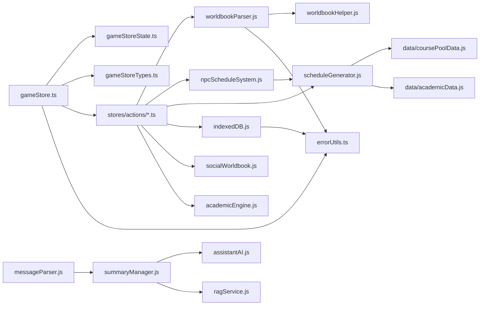

# Store / Utils / Data 地图（自动生成）

> 生成日期：2026-03-06  
> 关注范围：`school/src/stores`、`school/src/utils`、`school/src/data`。

## 核心结构

- `gameStore.ts` 是 Pinia 聚合层，自身很薄，主要职责是装配 state、types 与 15 个 action 模块。
- action 层按领域拆分为学业、班级社团、选修、事件天气、存档、时间推进、学年推进等模块。
- `utils/` 是真正的领域服务层；其中世界书、NPC 日程、总结/RAG、关系、消息解析与本地持久化最关键。
- `data/` 提供课程池、地图、关系规则、学业规则等相对稳定的基础数据。

## 核心依赖图

## 核心被依赖模块

- `school/src/utils/errorUtils.ts`：被依赖 34 次。
- `school/src/utils/worldbookHelper.js`：被依赖 20 次。
- `school/src/utils/worldbookParser.js`：被依赖 14 次。
- `school/src/utils/indexedDB.js`：被依赖 13 次。
- `school/src/utils/npcScheduleSystem.js`：被依赖 13 次。
- `school/src/utils/scheduleGenerator.js`：被依赖 12 次。
- `school/src/utils/summaryManager.js`：被依赖 11 次。
- `school/src/utils/relationshipManager.js`：被依赖 9 次。
- `school/src/utils/socialWorldbook.js`：被依赖 6 次。
- `school/src/utils/todoManager.js`：被依赖 6 次。
- `school/src/utils/assistantAI.js`：被依赖 5 次。
- `school/src/utils/editionDetector.ts`：被依赖 5 次。

## Store / Action 索引

### `stores`

| 文件 | 行数 | 出度 | 入度 | 关键依赖 | 函数摘录 |
|---|---|---|---|---|---|
| `school/src/stores/gameStore.ts` | 80 | 16 | 57 | `gameStoreTypes.ts`、`gameStoreState.ts`、`forumActions.ts`、`partTimeDeliveryActions.ts` | `useGameStore` |
| `school/src/stores/gameStoreState.ts` | 349 | 1 | 4 | `gameStoreTypes.ts` | `createInitialState`、`createInitialPlayerState`、`createInitialGameTime`、`createInitialWorldState` |
| `school/src/stores/gameStoreTypes.ts` | 813 | 0 | 14 | — | — |

### `stores/actions`

| 文件 | 行数 | 出度 | 入度 | 关键依赖 | 函数摘录 |
|---|---|---|---|---|---|
| `school/src/stores/actions/academicActions.ts` | 517 | 5 | 2 | `academicEngine.js`、`academicWorldbook.js`、`academicData.js`、`coursePoolData.js` | `academicActions` |
| `school/src/stores/actions/classClubActions.ts` | 1091 | 17 | 2 | `gameStoreTypes.ts`、`worldbookParser.js`、`forumWorldbook.js`、`socialWorldbook.js` | `addNpc`、`addMember`、`safeRebuildStep`、`classClubActions` |
| `school/src/stores/actions/electiveActions.ts` | 174 | 4 | 2 | `coursePoolData.js`、`electiveWorldbook.js`、`scheduleGenerator.js`、`random.js` | `electiveActions` |
| `school/src/stores/actions/eventWeatherActions.ts` | 329 | 3 | 2 | `gameStoreTypes.ts`、`eventSystem.js`、`weatherGenerator.js` | `eventWeatherActions` |
| `school/src/stores/actions/forumActions.ts` | 53 | 1 | 2 | `gameStoreTypes.ts` | `forumActions` |
| `school/src/stores/actions/index.ts` | 19 | 14 | 0 | `forumActions.ts`、`partTimeDeliveryActions.ts`、`eventWeatherActions.ts`、`socialActions.ts` | — |
| `school/src/stores/actions/inventoryActions.ts` | 320 | 1 | 2 | `gameStoreTypes.ts` | `inventoryActions` |
| `school/src/stores/actions/partTimeDeliveryActions.ts` | 286 | 3 | 2 | `gameStoreTypes.ts`、`deliveryWorldbook.js`、`partTimeWorldbook.js` | `partTimeDeliveryActions` |
| `school/src/stores/actions/playerActions.ts` | 453 | 4 | 2 | `gameStoreTypes.ts`、`mapData.js`、`relationshipData.js`、`partTimeWorldbook.js` | `playerActions` |
| `school/src/stores/actions/schoolRuleActions.ts` | 148 | 1 | 2 | `schoolRuleWorldbook.js` | `schoolRuleActions` |
| `school/src/stores/actions/snapshotActions.ts` | 896 | 8 | 2 | `gameStoreTypes.ts`、`indexedDB.js`、`academicWorldbook.js`、`gameStoreState.ts` | `createLightChatLogEntry`、`clonePlayerForSnapshot`、`snapshotActions` |
| `school/src/stores/actions/socialActions.ts` | 180 | 1 | 2 | `gameStoreTypes.ts` | `socialActions` |
| `school/src/stores/actions/storageActions.ts` | 965 | 7 | 2 | `gameStoreTypes.ts`、`indexedDB.js`、`errorUtils.ts`、`relationshipData.js` | `safeExec`、`validateAndRepairSettings`、`validateSnapshot`、`cleanAndMigrateSnapshots`、`doSave` |
| `school/src/stores/actions/timeActions.ts` | 187 | 3 | 2 | `scheduleGenerator.js`、`npcScheduleSystem.js`、`summaryManager.js` | `timeActions` |
| `school/src/stores/actions/yearProgressionActions.ts` | 1091 | 9 | 2 | `gameStoreTypes.ts`、`scheduleGenerator.js`、`relationshipData.js`、`coursePoolData.js` | `extractGrade`、`extractClassLetter`、`makeClassId`、`makeClassName`、`isIdolRelated` |

### Action 到 Utils / Data 的直接依赖

| Action | 关键 Utils / Data | 函数摘录 |
|---|---|---|
| `school/src/stores/actions/academicActions.ts` | 517 | `school/src/utils/academicEngine.js`、`school/src/utils/academicWorldbook.js`、`school/src/data/academicData.js`、`school/src/data/coursePoolData.js` | `academicActions` |
| `school/src/stores/actions/classClubActions.ts` | 1091 | `school/src/utils/worldbookParser.js`、`school/src/utils/forumWorldbook.js`、`school/src/utils/socialWorldbook.js`、`school/src/utils/partTimeWorldbook.js`、`school/src/utils/impressionWorldbook.js`、`school/src/utils/scheduleGenerator.js` | `addNpc`、`addMember`、`safeRebuildStep`、`classClubActions` |
| `school/src/stores/actions/electiveActions.ts` | 174 | `school/src/data/coursePoolData.js`、`school/src/utils/electiveWorldbook.js`、`school/src/utils/scheduleGenerator.js`、`school/src/utils/random.js` | `electiveActions` |
| `school/src/stores/actions/eventWeatherActions.ts` | 329 | `school/src/utils/eventSystem.js`、`school/src/utils/weatherGenerator.js` | `eventWeatherActions` |
| `school/src/stores/actions/forumActions.ts` | 53 | — | `forumActions` |
| `school/src/stores/actions/index.ts` | 19 | — | — |
| `school/src/stores/actions/inventoryActions.ts` | 320 | — | `inventoryActions` |
| `school/src/stores/actions/partTimeDeliveryActions.ts` | 286 | `school/src/utils/deliveryWorldbook.js`、`school/src/utils/partTimeWorldbook.js` | `partTimeDeliveryActions` |
| `school/src/stores/actions/playerActions.ts` | 453 | `school/src/data/mapData.js`、`school/src/data/relationshipData.js`、`school/src/utils/partTimeWorldbook.js` | `playerActions` |
| `school/src/stores/actions/schoolRuleActions.ts` | 148 | `school/src/utils/schoolRuleWorldbook.js` | `schoolRuleActions` |
| `school/src/stores/actions/snapshotActions.ts` | 896 | `school/src/utils/indexedDB.js`、`school/src/utils/academicWorldbook.js`、`school/src/utils/snapshotUtils.ts`、`school/src/utils/editionDetector.ts`、`school/src/utils/errorUtils.ts`、`school/src/utils/relationshipManager.js` | `createLightChatLogEntry`、`clonePlayerForSnapshot`、`snapshotActions` |
| `school/src/stores/actions/socialActions.ts` | 180 | — | `socialActions` |
| `school/src/stores/actions/storageActions.ts` | 965 | `school/src/utils/indexedDB.js`、`school/src/utils/errorUtils.ts`、`school/src/data/relationshipData.js`、`school/src/utils/socialRelationshipsWorldbook.js`、`school/src/utils/compressionUtils.js` | `safeExec`、`validateAndRepairSettings`、`validateSnapshot`、`cleanAndMigrateSnapshots`、`doSave` |
| `school/src/stores/actions/timeActions.ts` | 187 | `school/src/utils/scheduleGenerator.js`、`school/src/utils/npcScheduleSystem.js`、`school/src/utils/summaryManager.js` | `timeActions` |
| `school/src/stores/actions/yearProgressionActions.ts` | 1091 | `school/src/utils/scheduleGenerator.js`、`school/src/data/relationshipData.js`、`school/src/data/coursePoolData.js`、`school/src/utils/npcScheduleSystem.js`、`school/src/utils/indexedDB.js`、`school/src/utils/worldbookParser.js` | `extractGrade`、`extractClassLetter`、`makeClassId`、`makeClassName`、`isIdolRelated` |

### `data`

| 文件 | 行数 | 出度 | 入度 | 关键依赖 | 函数摘录 |
|---|---|---|---|---|---|
| `school/src/data/academicData.js` | 571 | 0 | 12 | — | `shouldHaveMonthlyExam`、`getExamType`、`getExamId`、`isWorkday`、`resolveExamDate` |
| `school/src/data/coursePoolData.js` | 1453 | 2 | 21 | `worldbookHelper.js`、`errorUtils.ts` | `resetCourseData`、`getCoursePoolState`、`restoreCoursePoolState`、`getGradeFromClassId`、`isIdolClass` |
| `school/src/data/mapData.js` | 43 | 0 | 13 | — | `getChildren`、`getItem`、`getPartTimeJobInfo`、`getIdByName`、`setMapData` |
| `school/src/data/relationshipData.js` | 1625 | 0 | 13 | — | `calculateRelationshipScore`、`getEmotionalState`、`shouldBeSocialFriend`、`getRelationshipDescription`、`generateCharId` |

### `utils`

| 文件 | 行数 | 出度 | 入度 | 关键依赖 | 函数摘录 |
|---|---|---|---|---|---|
| `school/src/utils/academicEngine.js` | 438 | 1 | 2 | `academicData.js` | `generateNpcExamScores`、`calculateClassRanking`、`calculateInterClassRanking`、`initializeNpcAcademicStats`、`calculateTeachingGrowth` |
| `school/src/utils/academicWorldbook.js` | 168 | 3 | 3 | `academicEngine.js`、`academicData.js`、`worldbookHelper.js` | `generateAcademicWorldbookText`、`generateNpcAcademicBrief`、`updateAcademicWorldbookEntry` |
| `school/src/utils/assistantAI.js` | 580 | 4 | 5 | `gameStore.ts`、`prompts.js`、`worldbookHelper.js`、`errorUtils.ts` | `validateAssistantAIConfig`、`getWorldbookContent`、`getVariableParsingEntryContent`、`getActiveWorldbooksContent`、`callAssistantAI` |
| `school/src/utils/compressionUtils.js` | 70 | 0 | 1 | — | `compressData`、`decompressData`、`isCompressed` |
| `school/src/utils/conditionChecker.js` | 475 | 1 | 2 | `constants.js` | `checkOpenTime`、`checkUnlockCondition`、`checkAccess`、`checkPartTimeJobRequirements`、`checkPartTimeJobEligibility` |
| `school/src/utils/constants.js` | 26 | 0 | 2 | — | `WEEKDAY_MAP` |
| `school/src/utils/contentCleaner.js` | 162 | 2 | 1 | `gameStore.ts`、`summaryManager.js` | `cleanSystemTags`、`parseInsertImageTags`、`insertImagesAtAnchors` |
| `school/src/utils/debugFormatter.js` | 57 | 0 | 1 | — | `formatDebugContent`、`parseDebugData`、`parseDebugTag` |
| `school/src/utils/deliveryWorldbook.js` | 341 | 2 | 4 | `errorUtils.ts`、`worldbookHelper.js` | `parseProductCatalog`、`filterProductsByMonth`、`filterProductsByCategory`、`getCategories`、`isEquipableProduct` |
| `school/src/utils/domainBlacklist.ts` | 16 | 0 | 1 | — | `isBlacklistedDomain` |
| `school/src/utils/editionDetector.ts` | 41 | 1 | 5 | `worldbookHelper.js` | `detectCardEdition`、`getEditionLabel`、`getEditionShortLabel`、`GAME_VERSION` |
| `school/src/utils/electiveWorldbook.js` | 219 | 5 | 3 | `gameStore.ts`、`coursePoolData.js`、`random.js`、`scheduleGenerator.js` | `isWorldbookApiReady`、`getTargetWorldbookName`、`updateElectiveWorldbookEntries`、`clearElectiveEntries`、`syncElectiveWorldbookState` |
| `school/src/utils/errorUtils.ts` | 44 | 0 | 34 | — | `isErrorLike`、`getErrorMessage`、`getErrorName`、`normalizeText` |
| `school/src/utils/eventSystem.js` | 673 | 3 | 2 | `gameStore.ts`、`worldbookHelper.js`、`errorUtils.ts` | `parseEventLibrary`、`parseTriggerData`、`checkVariableCondition`、`calculateTotalDays`、`checkDailyTriggers` |
| `school/src/utils/forumWorldbook.js` | 399 | 2 | 4 | `gameStore.ts`、`worldbookHelper.js` | `getForumWorldbookName`、`formatPostsForWorldbook`、`generatePostId`、`saveForumToWorldbook`、`loadForumFromWorldbook` |
| `school/src/utils/gameDataParser.js` | 612 | 3 | 2 | `gameStore.ts`、`messageParser.js`、`npcScheduleSystem.js` | `processNpcMoveUpdate`、`processOutfitUpdate`、`parseGameData`、`analyzeChanges`、`deepMerge` |
| `school/src/utils/imageDB.js` | 143 | 0 | 1 | — | `getDB`、`base64ToBlob`、`saveImageToDB`、`getImageFromDB`、`deleteImageFromDB` |
| `school/src/utils/imageGenerator.js` | 119 | 1 | 1 | `errorUtils.ts` | `requestImageGeneration`、`generateUniqueId`、`cleanup`、`imageResponseHandler` |
| `school/src/utils/impressionWorldbook.js` | 312 | 2 | 4 | `gameStore.ts`、`worldbookHelper.js` | `getValidPlayerRelation`、`getCurrentRunId`、`getCurrentBookName`、`formatImpressionContent`、`performSaveImpressionData` |
| `school/src/utils/indexedDB.js` | 537 | 2 | 13 | `errorUtils.ts`、`snapshotUtils.ts` | `isDevEnv`、`assertSerializableInDev`、`openDB`、`setItem`、`getItem` |
| `school/src/utils/messageParser.js` | 1268 | 7 | 2 | `socialWorldbook.js`、`gameStore.ts`、`summaryManager.js`、`forumWorldbook.js` | `extractSuggestedReplies`、`processNpcMoodUpdate`、`extractTucao`、`processNpcRelationshipUpdate`、`getGameTimeString` |
| `school/src/utils/npcScheduleSystem.js` | 2636 | 6 | 13 | `random.js`、`scheduleGenerator.js`、`mapData.js`、`coursePoolData.js` | `calculateTotalHours`、`isOutdoorLocation`、`getLocationCategories`、`getLocationsByCategory`、`getNpcTemplate` |
| `school/src/utils/partTimeWorldbook.js` | 243 | 2 | 4 | `gameStore.ts`、`worldbookHelper.js` | `getCurrentBookName`、`getEntryName`、`generatePartTimeContent`、`updatePartTimeWorldbookEntry`、`togglePartTimeEntry` |
| `school/src/utils/performanceTest.js` | 158 | 3 | 0 | `gameDataParser.js`、`snapshotUtils.ts`、`useDanmaku.js` | `testFastClone`、`testVariableComparison`、`testDanmakuPerformance`、`runAllTests` |
| `school/src/utils/prompts.js` | 1731 | 9 | 3 | `scheduleGenerator.js`、`eventSystem.js`、`relationshipManager.js`、`relationshipData.js` | `getDefaultOutfit`、`getPlayerOutfitString`、`getNpcOutfitString`、`isOnCampus`、`buildSchoolRulePrompt` |
| `school/src/utils/ragService.js` | 901 | 6 | 3 | `gameStore.ts`、`summaryManager.js`、`npcScheduleSystem.js`、`assistantAI.js` | `cosineSimilarity`、`extractKeywordsFromSummary`、`calcAutoRAGParams`、`getEffectiveRAGParams`、`isRAGReady` |
| `school/src/utils/random.js` | 14 | 0 | 5 | — | `seededRandom` |
| `school/src/utils/relationshipManager.js` | 923 | 5 | 9 | `gameStore.ts`、`relationshipData.js`、`impressionWorldbook.js`、`socialRelationshipsWorldbook.js` | `clearPendingSocialData`、`lookupGender`、`getAllCharacterNames`、`getCharacterData`、`getRelationship` |
| `school/src/utils/retryHelper.js` | 110 | 1 | 1 | `errorUtils.ts` | `parseErrorMessage`、`formatErrorForDisplay`、`withRetry` |
| `school/src/utils/scheduleGenerator.js` | 1367 | 4 | 12 | `random.js`、`constants.js`、`coursePoolData.js`、`academicData.js` | `checkVacation`、`checkDayStatus`、`isWeekend`、`getWeekdayChinese`、`getWeekdayEnglish` |
| `school/src/utils/schoolRuleWorldbook.js` | 247 | 1 | 1 | `worldbookHelper.js` | `getSchoolRuleWorldbookName`、`formatRulesForWorldbook`、`saveSchoolRulesToWorldbook`、`deleteSchoolRuleWorldbook`、`switchSchoolRuleSlot` |
| `school/src/utils/snapshotUtils.ts` | 629 | 1 | 3 | `gameStoreTypes.ts` | `computeDelta`、`applyDelta`、`applyDeltas`、`shouldCreateBaseSnapshot`、`isDeltaSnapshot` |
| `school/src/utils/socialRelationshipsWorldbook.js` | 230 | 2 | 5 | `relationshipData.js`、`worldbookHelper.js` | `ensureSocialDataWorldbook`、`fetchSocialData`、`deepMergeSocialData`、`saveSocialData`、`buildInitialData` |
| `school/src/utils/socialWorldbook.js` | 840 | 2 | 6 | `gameStore.ts`、`worldbookHelper.js` | `getCurrentRunId`、`getEntryPrefix`、`getMomentPrefix`、`normalizeId`、`parseEntryContent` |
| `school/src/utils/stClient.js` | 189 | 2 | 1 | `gameStore.ts`、`prompts.js` | `checkTruncation`、`generateReply`、`stopGeneration`、`generateStreaming`、`eventHandler` |
| `school/src/utils/summaryManager.js` | 1101 | 5 | 11 | `gameStore.ts`、`assistantAI.js`、`ragService.js`、`todoManager.js` | `cleanImageTags`、`removeThinking`、`extractSummary`、`removeSummariesAfterFloor`、`removeSummaryAtFloor` |
| `school/src/utils/todoManager.js` | 324 | 1 | 6 | `gameStore.ts` | `extractTodoCompletionCommands`、`parseTodoItems`、`matchTodoByKeyword`、`markTodoAsCompletedByKeyword`、`markTodoAsCompletedByIndex` |
| `school/src/utils/weatherGenerator.js` | 903 | 1 | 2 | `random.js` | `getSeason`、`generateWeatherForecast`、`getCurrentWeatherAtHour`、`detectWeatherChange`、`getWeatherGradient` |
| `school/src/utils/worldbookDiff.js` | 419 | 5 | 1 | `worldbookParser.js`、`coursePoolData.js`、`worldbookHelper.js`、`gameStore.ts` | `formatValueForDisplay`、`diffClasses`、`diffClubs`、`diffAcademic`、`diffCoursePool` |
| `school/src/utils/worldbookHelper.js` | 85 | 1 | 20 | `errorUtils.ts` | `getCurrentBookName`、`getPrimaryBookName`、`getAllBookNames`、`isWorldbookAvailable` |
| `school/src/utils/worldbookParser.js` | 2850 | 5 | 14 | `coursePoolData.js`、`npcScheduleSystem.js`、`academicData.js`、`worldbookHelper.js` | `parseClubData`、`parseClassData`、`parseMapData`、`parsePersonInfo`、`fetchAcademicDataFromWorldbook` |

## 维护提示

- `errorUtils.ts` 是跨层通用依赖；新增模块时继续统一用它包装错误文案，能明显降低排障成本。
- `worldbookParser.js` 与 `npcScheduleSystem.js` 都是跨多领域枢纽；修改时建议优先补充脚本级 diff 检查，避免破坏世界书或时间推进链路。
- 如果后续要做更准确的函数级依赖图，可以在此脚本基础上切换到 Babel / TypeScript AST。
